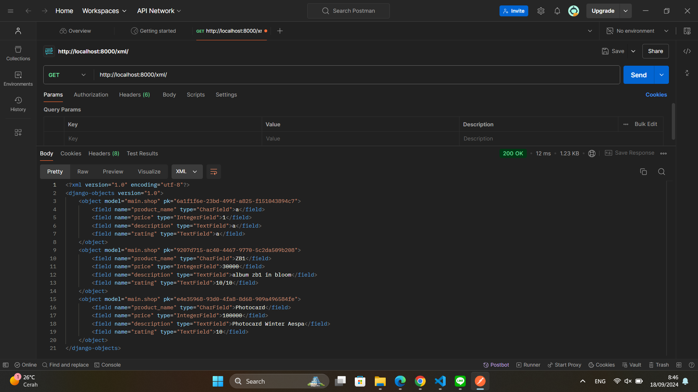
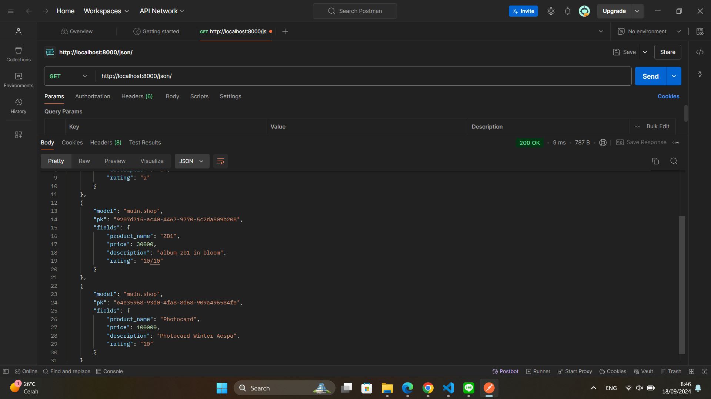
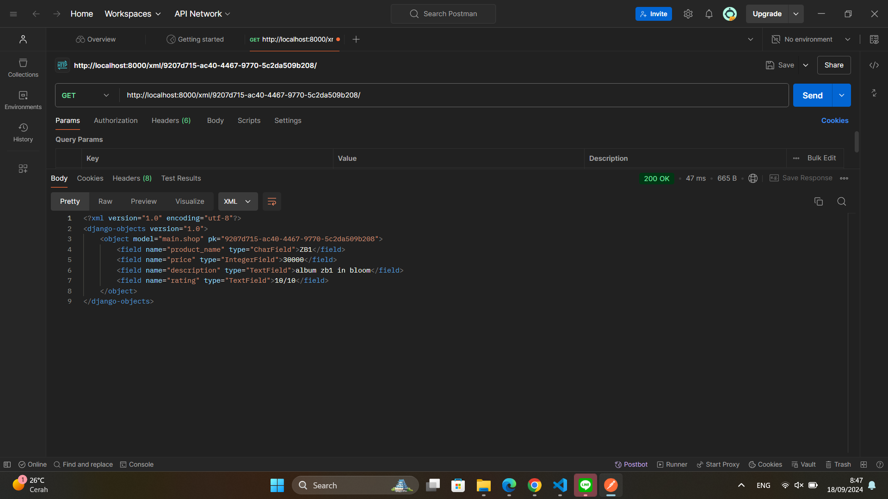
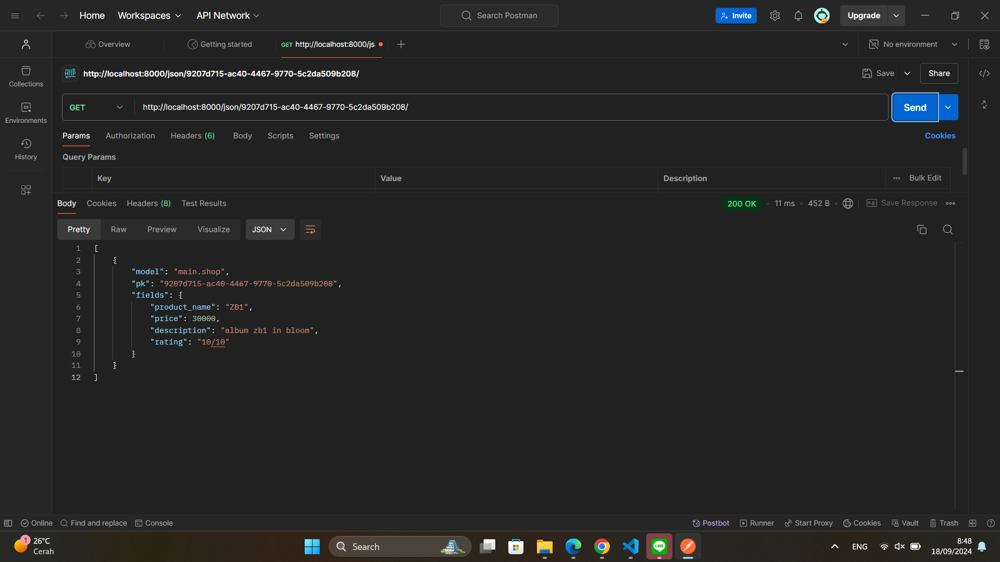

Nama : Azzahra Salsabila
NPM : 2306219934
Kelas : PBP A

# TUGAS 2
* ***Jelaskan bagaimana cara kamu mengimplementasikan checklist di atas secara step-by-step (bukan hanya sekadar mengikuti tutorial).***
Cara saya membuat proyek django baru adalah dengan:
  1. Membuat Proyek Django Baru
  Langkah: Membuat proyek Django baru di direktori terpisah dengan nama proyek **SeoulnSound**, dengan membuat folder proyek, mengaktifkan virtual environment, install Django, dan menjalankan server lokal untuk memastikan instalasi berjalan lancar.
  2. Membuat Aplikasi dengan Nama **main**
  Langkah: Di dalam proyek, saya membuat aplikasi dengan nama main dengan menggunakan perintah ```python manage.py startapp main``` dan menambahkan aplikasi ini ke INSTALLED_APPS di settings.py.
  3. Mengimplementasikan Template dasar
  Langkah: Membuat file HTML lalu diisi dengan atribut application name, self name, pbp class, product name, price, description dan rating.
  4. Membuat Model "Product" pada Aplikasi "main"
  Langkah: Membuat model Product dengan atribut application name, self name, pbp class, product name, price, description dan rating di models.py aplikasi main, lalu lakukan migrasi dengan ```makemigrations``` dan ```migrate```.
  5. Mengintegrasikan komponen MVT
  Langkah: Membuat fungsi di views.py dengan menggunakan render untuk mengembalikan template HTML dengan application name, self name, pbp class, product name, price, description dan rating.
  6. Membuat Routing di urls.py Aplikasi "main"
  Langkah: Menambahkan routing di urls.py aplikasi main untuk mengarahkan URL spesifik ke fungsi yang telah dibuat.
  7. Deployment ke Pacil Web Service (PWS)
  Langkah: Melakukan deploy proyek Django ke PWS agar dapat diakses oleh mahasiswa lain dengan mengikuti prosedur PWS untuk deployment, unggah perubahan ke server, dan memastikan aplikasi dapat diakses melalui internet.

* ***Buatlah bagan yang berisi request client ke web aplikasi berbasis Django beserta responnya dan jelaskan pada bagan tersebut kaitan antara urls.py, views.py, models.py, dan berkas html.***

User akan mengakses URL melalui internet lalu akan dilakukan HTTP Request yang akan diterima oleh urls.py, setelah itu urls.py akan mencocokkan URL dengan fungsi yang tepat di views.py. Kita menggunakan template yang akan ditampilkan di views.py, dan memanggil data yang diperlukan dari database melalui models.py, data-data ini diproses di views.py untuk menampilkan halaman yang sesuai.  Setelah itu, tampilan halaman ini dikirim kembali ke pengguna sebagai respons HTTP yang berisi kode HTML.

* ***Jelaskan fungsi git dalam pengembangan perangkat lunak!***
Git berguna sebagai alat kontrol sistem yang membantu dalam pelacakan setiap perubahan yang terjadi dalam proyek. Git bisa digunakan untuk bekerja sama dalam tim, kembali ke versi sebelumnya, menyimpan catatan perubahan, serta mengatur branch untuk pengembangan fitur tanpa mengganggu proyek utama atau proyek lain.

* ***Menurut Anda, dari semua framework yang ada, mengapa framework Django dijadikan permulaan pembelajaran pengembangan perangkat lunak?***
Django dipilih sebagai awal dalam pembelajaran pengembangan perangkat lunak karena menyederhanakan proses pengembangan dengan adanya fitur-fitur bawaan seperti autentikasi, ORM, dan manajemen admin. Django juga memiliki tata letak yang teratur dan mendukung pola MVC (Model-View-Controller) atau MVT (Model-View-Template), sehingga mempermudah pemahaman dasar pengembangan web. Selain itu, Django memiliki dokumentasi yang lengkap dan komunitas yang besar, sehingga memudahkan developer dalam mempelajari dan mengatasi masalah yang dihadapi.

* ***Mengapa model pada Django disebut sebagai ORM?***
Model di Django dinamakan sebagai ORM (Object-Relational Mapping) karena berfungsi sebagai penghubung antara database dan kode Python. ORM membantu developer bekerja dengan database dengan menggunakan objek Python dibanding menggunakan query SQL secara langsung. Hal ini membuat manipulasi data menjadi lebih mudah tanpa harus memiliki pengetahuan yang mendalam tentang SQL, dan memastikan konsistensi dan efisiensi interaksi dengan berbagai jenis database.

---

# TUGAS 3
* ***Jelaskan mengapa kita memerlukan data delivery dalam pengimplementasian sebuah platform?***
Data delivery diperlukan dalam pengimplementasian platform untuk memastikan data yang dikirimkan dari server ke client atau sebaliknya dapat diterima dengan baik. Data delivery memastikan data yang dikirimkan tidak hilang, tidak rusak, dan tidak terduplikasi, serta dapat diakses oleh pengguna dengan cepat dan aman. Data delivery juga memastikan data yang dikirimkan sesuai dengan format yang diinginkan oleh pengguna, sehingga dapat meningkatkan kualitas pengalaman pengguna dalam menggunakan platform.

* ***Menurutmu, mana yang lebih baik antara XML dan JSON? Mengapa JSON lebih populer dibandingkan XML?***
Menurut saya, JSON lebih baik daripada XML karena JSON lebih ringan, mudah dibaca, dan mudah dipahami oleh manusia. JSON juga lebih efisien dalam penggunaan memori dan lebih cepat dalam proses parsing data. JSON juga lebih populer dibandingkan XML karena JSON lebih sederhana, lebih ringan, dan lebih mudah digunakan dalam pengembangan aplikasi web dan mobile, dan lebih fleksibel dalam penggunaan serta lebih mudah diintegrasikan dengan berbagai bahasa pemrograman.

* ***Jelaskan fungsi dari method is_valid() pada form Django dan mengapa kita membutuhkan method tersebut?***
Method ```is_valid()``` pada form Django digunakan untuk memvalidasi data yang dimasukkan oleh pengguna melalui form. Method ini memeriksa apakah data yang dimasukkan sesuai dengan aturan yang telah ditentukan dalam form. Kita membutuhkan method ```is_valid()``` untuk memastikan data yang dimasukkan oleh pengguna valid dan aman, sehingga dapat mencegah terjadinya serangan seperti SQL injection, XSS, dan CSRF. Method ```is_valid()``` juga membantu dalam mengurangi kesalahan input data dan memastikan data yang disimpan dalam database sesuai dengan format yang diinginkan.

* ***Mengapa kita membutuhkan csrf_token saat membuat form di Django? Apa yang dapat terjadi jika kita tidak menambahkan csrf_token pada form Django? Bagaimana hal tersebut dapat dimanfaatkan oleh penyerang?***
Kita membutuhkan ```csrf_token``` saat membuat form di Django untuk mencegah serangan CSRF (Cross-Site Request Forgery) yang dapat membahayakan keamanan aplikasi web. CSRF adalah serangan yang memanfaatkan kepercayaan pengguna terhadap situs web yang sah untuk melakukan tindakan yang tidak diinginkan, seperti mengirimkan data palsu atau merusak data yang ada. Jika kita tidak menambahkan ```csrf_token``` pada form Django, maka form tersebut rentan terhadap serangan CSRF, di mana penyerang dapat memanfaatkan form tersebut untuk mengirimkan data palsu atau merusak data yang ada. Penyerang dapat memanfaatkan kelemahan ini untuk mencuri data pengguna, merusak data yang ada, atau mengubah data yang disimpan dalam database.

* ***Jelaskan bagaimana cara kamu mengimplementasikan checklist di atas secara step-by-step (bukan hanya sekadar mengikuti tutorial).***
Cara saya mengimplementasikan checklist di atas adalah dengan:
1. Implementasi skeleton sebagai kerangka views
Langkah: Membuat skeleton sebagai kerangka views agar tidak terjadi redudancy pada kode dan agar tampilan pada website tetap konsisten.
2. Mengimport UUID
Langkah: Mengimport UUID untuk membuat unique identifier pada setiap data yang dimasukkan ke dalam database.
3. Membuat form input untuk menambahkan data
Langkah: Membuat file ```forms.py``` untuk membuat form input yang berisi product name, price, description, dan rating.
4. Membuat fungsi ```create_shop_entry```
Langkah: Lalu membuat fungsi ```create_shop_entry``` yang menerima request lalu menghasilkan form yang dapat menambahkan data yang telah diisi.
5. Membuat berkas ```create_shop_entry.html```
Langkah: Membuat berkas ```create_shop_entry.html``` sebagai template untuk menampilkan form input yang telah dibuat.
6. Mengembalikan data dalam bentuk XML, JSON, dan ID
Langkah: Pada ```views.py``` buat fungsi baru dengan nama ```show_xml, show_json, show_json_by_id, dan show_xml_by_id``` yang mengembalikan data dalam bentuk XML, JSON, dan ID. Lalu di tiap bentuk, tambahkan path url dalam ```urlpatterns``` dan melakukan import.
7. Menggunakan postman sebagai data viewer
Langkah: Menginstall postman lalu membuat request baru dengan menginput local host.

***Hasil screenshot dari hasil akses URL pada Postman***
1. XML

2. JSON

3. XML by ID

4. JSON by ID


---

# TUGAS 4
* ***Apa perbedaan antara HttpResponseRedirect() dan redirect()***
Perbedaan antara ```HttpResponseRedirect()``` dan ```redirect()``` adalah, ```HttpResponseRedirect()``` hanya menerima URL dalam bentuk string dan melakukan return respons HTTP dengan kode 302 (Redirect). Sedangkan ```redirect()``` adalah fungsi utilitas yang lebih fleksibel dan mudah digunakan. Selain menerima string URL seperti ```HttpResponseRedirect()```, ```redirect()``` juga bisa menerima nama view, beserta argumen, atau objek model yang otomatis akan diarahkan ke URL yang sesuai dengan metode ```get_absolute_url()```. Dalam syntax, ```redirect()``` lebih ringkas dan mendukung berbagai skenario, sehingga lebih sering digunakan dalam praktik.

* ***Jelaskan cara kerja penghubungan model Product dengan User!***
 Untuk menghubungan model product, dalam program kali ini yaitu Shop, dengan user, kita dapat menggunakan foreign key. Langkah-langkahnya:
 1. Menghubungkan Model ```Shop``` dengan User
 Langkah ini bertujuan untuk menghubungkan setiap model yang dibuat dengan user. Dengan menambahkan relasi antara model dan model User dengan menggunakan ForeignKey, kita memastikan bahwa setiap model memiliki pemilik yang jelas. Nantinya, model tersebut dapat diidentifikasi berdasarkan siapa yang membuatnya, dan user hanya dapat mengakses model milik mereka sendiri.
 Langkah ini dilakukan dengan memasukkan kode di bawah
 ```from django.contrib.auth.models import User```
 ```class Shop(models.Model):```
    ```user = models.ForeignKey(User, on_delete=models.CASCADE)```
 2. Menambahkan user ke model di fungsi ```create_shop_entry```
 Langkah ini memastikan bahwa ketika user mengirimkan form untuk membuat model, model tersebut otomatis terintegrasi dengan user yang sedang login. Dengan menambahkan user (```request.user```) ke model sebelum disimpan ke database, kita bisa melacak siapa yang membuat entri tersebut.
 Langkah ini dilakukan dengan memasukkan kode ```shop_entry.user = request.user```
 3. Melakukan filter berdasarkan user
  Langkah ini memastikan bahwa user hanya dapat melihat model yang mereka buat. Dengan melakukan filter berdasarkan user yang sedang login, kita memastikan bahwa user hanya dapat melihat model yang mereka miliki, dan tidak bisa melihat model milik user lain. Lankah ini dilakukan dengan memasukkan kode ```shop_entries = Shop.objects.filter(user=request.user)```

* ***Apa perbedaan antara authentication dan authorization, apakah yang dilakukan saat pengguna login? Jelaskan bagaimana Django mengimplementasikan kedua konsep tersebut.***
1. Authentication atau autentikasi adalah proses verifikasi identitas seseorang. Tujuannya untuk memastikan bahwa pengguna yang mengakses adalah orang yang seharusnya. Autentikasi biasanya dilakukan dengan menggunakan username dan password, atau metode lain seperti token, fingerprint, atau biometrik.
Django mengimplementasikan autentikasi melalui middleware dan model User bawaan. Autentikasi dimulai ketika pengguna mencoba login dengan mengirimkan kredensial, seperti username dan password. Lalu, Django memanfaatkan fungsi authenticate() untuk memeriksa apakah kombinasi tersebut cocok dengan data di database. Jika cocok, fungsi login() digunakan untuk menyimpan informasi pengguna dalam session, sehingga pengguna tetap terotentikasi di seluruh aplikasi. Middleware ```AuthenticationMiddleware``` memastikan bahwa setiap permintaan dari pengguna yang sudah login secara otomatis memiliki objek ```request.user``` yang berisi data pengguna yang aktif. Jika pengguna belum login, ```request.user``` akan diisi dengan AnonymousUser, yang tidak memiliki akses khusus.

2. Authorization atau otorisasi adalah proses untuk menentukan hak atau izin yang dimiliki oleh pengguna untuk mengakses hal tertentu. Otorisasi mengatur apa yang boleh dan yang tidak boleh dilakukan oleh pengguna saat mereka sudah terautentikasi. Otorisasi biasanya dilakukan dengan menggunakan role, group, atau permission yang diberikan kepada pengguna.
Django menggunakan sistem izin (permissions) dan dekorator (decorators) untuk mengatur akses pengguna berdasarkan hak tertentu. Permissions di Django dapat berupa izin default, seperti add, change, delete, dan view pada model tertentu, atau izin khusus yang bisa diatur sesuai kebutuhan. Untuk mempermudah penerapan otorisasi di tampilan, Django menyediakan dekorator seperti ```@login_required```, yang memastikan hanya pengguna yang telah login yang dapat mengakses tampilan tertentu. Selain itu, dekorator ```@permission_required``` memeriksa apakah pengguna memiliki izin spesifik untuk melakukan tindakan tertentu, misalnya mengedit atau menghapus data. Dengan ini, Django memastikan bahwa pengguna tidak hanya terautentikasi tetapi juga hanya memiliki akses ke sumber daya yang sesuai dengan izin mereka. 

* ***Bagaimana Django mengingat pengguna yang telah login? Jelaskan kegunaan lain dari cookies dan apakah semua cookies aman digunakan?***
Django mengingat pengguna yang telah login dengan menggunakan cookies dan session framework. Saat pengguna berhasil login, Django akan membuat session di sisi server yang menyimpan informasi tentang pengguna, seperti ID pengguna yang sedang aktif. Di sisi klien (browser), Django mengirimkan cookie yang berisi ID sesi (session ID) sebagai pengenal. Setiap kali pengguna mengirimkan permintaan baru (misalnya membuka halaman lain), browser akan mengirimkan kembali cookie ini ke server. Django kemudian menggunakan session ID tersebut untuk mencari data pengguna di server dan mengaitkan pengguna yang sedang login dengan objek ```request.user```.
Tidak semua cookies aman digunakan, karena ada beberapa faktor keamanan yang perlu dipertimbangkan saat menggunakan cookies seperti session hijacking, XSS, CRSF, dan cookie manipulation. Cookies aman digunakan jika diatur dengan benar, seperti mengaktifkan ```HttpOnly``` dan ```Secure``` flag, serta mengenkripsi data yang sensitif.

* ***Jelaskan bagaimana cara kamu mengimplementasikan checklist di atas secara step-by-step (bukan hanya sekadar mengikuti tutorial).***
Cara saya mengimplementasikan checklist di atas adalah dengan:
1. Membuat fungsi registrasi
Langkah: Di dalam file ```views.py```, kita mulai dengan mengimpor ```UserCreationForm``` dan modul lain yang diperlukan. Fungsi ini memeriksa apakah request yang diterima adalah POST dan menggunakan ```UserCreationForm``` untuk memvalidasi data yang dimasukkan. Jika data valid, pengguna akan disimpan dan diarahkan ke halaman login dengan pesan sukses. Selanjutnya, kita perlu membuat template registrasi dengan nama ```register.html```, yang berisi formulir untuk mendaftar dan menampilkan pesan sukses jika ada.
2. Membuat fungsi login
Langkah: Di dalam ```views.py```, kita mengimpor ```AuthenticationForm```, ```authenticate```, dan ```login```. Kita membuat fungsi ```login_user```, yang menangani input pengguna dan menggunakan authenticate untuk memverifikasi kredensial. Jika autentikasi berhasil, sesi pengguna akan disimpan, dan mereka akan diarahkan ke halaman utama dengan pesan. Untuk mendukung fungsi ini, kita perlu membuat template login ```login.html``` yang berisi formulir login dan tautan ke halaman registrasi.
3. Membuat fungsi logout
Langkah: Di ```views.py```, kita mengimpor logout dan membuat fungsi ```logout_user```, yang akan memanggil fungsi logout untuk menghapus sesi pengguna. Setelah logout berhasil, pengguna akan diarahkan ke halaman login dengan pesan konfirmasi. Untuk membuat navigasi yang lebih mudah, kita tambahkan tombol logout di halaman utama.
4. Melakukan restriksi akses di halaman main
Langkah: Gunakan decorator ```@login_required``` pada fungsi yang menampilkan halaman tersebut. Decorator ini memastikan bahwa hanya pengguna yang sudah login yang dapat mengakses halaman utama dan yang lainnya akan diarahkan ke halaman login. 
5. Menggabungkan model dengan user.
Langkah: Di dalam ```models.py```, kita akan menambahkan field user pada model sebagai ForeignKey yang mengarah ke model User, sehingga setiap produk bisa terkait dengan pengguna tertentu.
6. Menampilkan informasi pengguna yang sedang login
Langkah: Dalam fungsi ```show_main```, kita mengambil ```request.user``` untuk mendapatkan informasi pengguna yang sedang login dan menambahkannya ke dalam konteks yang dikirim ke template. Di template halaman utama, kita menambahkan kode untuk menampilkan nama pengguna, sehingga mereka dapat melihat siapa yang sedang login. Kita juga menggunakan cookies dan last login dengan menggunakan ```response.set_cookie('last_login', ...)``` untuk mengatur cookie tersebut. Kemudian, kita akan menampilkan informasi waktu login di halaman utama dengan mengambil nilai cookie ```last_login``` dan menambahkannya ke dalam konteks yang dikirim ke template.

---

# TUGAS 5
***Jika terdapat beberapa CSS selector untuk suatu elemen HTML, jelaskan urutan prioritas pengambilan CSS selector tersebut!***
Urutan prioritas pengambilan CSS selector, yaitu
1. Inline CSS: Inline CSS memiliki prioritas tertinggi, karena didefinisikan langsung di dalam elemen HTML. Inline CSS ditulis di dalam atribut style pada tag HTML, dan akan mengambil alih semua deklarasi CSS lainnya, kecuali penggunaan ```!important```.
Contoh: ```<p style="color: red;">Ini adalah teks berwarna merah</p>```
2. ID Selector: ID selector memiliki prioritas kedua tertinggi, karena ID bersifat unik dan hanya boleh digunakan sekali dalam satu halaman. ID selector ditandai dengan tanda pagar (#) diikuti dengan nama ID.
Contoh: ```<p id="paragraf1">Ini adalah paragraf dengan ID paragraf1</p>```
3. Class Selector: Class selector memiliki prioritas ketiga, karena class dapat digunakan berulang kali dalam satu halaman. Class selector ditandai dengan titik (.) diikuti dengan nama class.
Contoh: ```<p class="important">Ini adalah paragraf penting</p>```
4. Element Selector: Element selector berlaku untuk semua elemen dengan tag yang sama. Element selector hanya menggunakan nama tag HTML.
Contoh: ```p { color: blue; }```
5. Universal Selector: Universal selector berlaku untuk semua elemen dalam halaman. Universal selector ditandai dengan tanda bintang (*).
Contoh: ```* { margin: 0; padding: 0; }```
Jika dua selector memiliki tingkat kekhususan yang sama, aturan yang terakhir didefinisikan dalam stylesheet akan digunakan.

***Mengapa responsive design menjadi konsep yang penting dalam pengembangan aplikasi web? Berikan contoh aplikasi yang sudah dan belum menerapkan responsive design!***
Responsive design menjadi konsep yang penting dalam pengembangan aplikasi web karena beberapa alasan. Pertama, dengan responsive design, aplikasi web dapat menyesuaikan tampilannya dengan berbagai ukuran layar, sehingga pengguna mendapatkan pengalaman yang optimal di perangkat dengan ukuran apapun. Hal ini memastikan bahwa konten dapat diakses dengan mudah oleh semua orang, pada semua perangkat. Yang kedua, Situs yang responsif dan dapat memberikan pengalaman pengguna yang baik akan lebih disukai banyak orang, responsive design yang berkontribusi pada SEO yang lebih baik, dapat membantu dalam peringkat pencarian, yang berarti lebih banyak pengunjung ke situs. Yang ketiga, penggunaan satu desain yang responsif juga mengurangi waktu dan usaha dalam pemeliharaan, karena kita tidak perlu membuat dan mengelola beberapa versi situs untuk berbagai perangkat. Terakhir, dengan semakin banyaknya pengguna yang mengakses web melalui perangkat mobile, responsive design memungkinkan aplikasi web untuk menjangkau audiens yang lebih luas.
Contoh aplikasi yang sudah menerapkan responsive design adalah Google, Facebook, dan Twitter. Contoh aplikasi yang belum menerapkan responsive design adalah situs web berita atau blog yang tidak menyesuaikan tampilan dengan baik di perangkat mobile, sehingga pengguna harus melakukan zoom in dan out untuk membaca konten.

***Jelaskan perbedaan antara margin, border, dan padding, serta cara untuk mengimplementasikan ketiga hal tersebut!***
1. Margin digunakan untuk memberikan jarak antara elemen dengan elemen lain di sekitarnya. Margin berada di luar border dan tidak berwarna. Margin dapat didefinisikan dengan menggunakan properti ```margin``` atau ```margin-top```, ```margin-right```, ```margin-bottom```, ```margin-left```.
Cara implementasinya:
```
div {
    margin: 10px;
}
```

2. Border digunakan untuk memberikan garis tepi pada elemen. Border berada di antara padding dan margin. Border dapat didefinisikan dengan menggunakan properti ```border``` atau ```border-top```, ```border-right```, ```border-bottom```, ```border-left```.
Cara implementasinya:
```
div {
    border: 5px solid black;
}
```

3. Padding digunakan untuk memberikan jarak antara elemen dengan border. Padding dapat didefinisikan dengan menggunakan properti ```padding``` atau ```padding-top```, ```padding-right```, ```padding-bottom```, ```padding-left```.
Cara implementasinya:
```
div {
    padding: 10px;
}
```

***Jelaskan konsep flex box dan grid layout beserta kegunaannya!***
1. Flexbox adalah teknik layouting CSS yang memungkinkan elemen di dalam container untuk menyesuaikan ukuran dan posisinya secara dinamis. Flexbox memungkinkan pengaturan layout yang responsif dan fleksibel, dengan mengatur elemen dalam satu dimensi (baris atau kolom) dan memungkinkan distribusi ruang secara merata. Flexbox sangat berguna untuk mengatur tata letak elemen dalam satu baris atau kolom, mengatur jarak antar elemen, dan mengatur posisi elemen secara fleksibel.
Cara implementasinya:
```
div {
    display: flex;
    justify-content: center;
    align-items: center;
}
```
2. Grid layout adalah teknik layouting CSS yang memungkinkan elemen di dalam container untuk diatur dalam grid dua dimensi (baris dan kolom). Grid layout memungkinkan pengaturan layout yang kompleks dan terstruktur, dengan mengatur elemen dalam grid yang terdiri dari baris dan kolom. Grid layout sangat berguna untuk mengatur tata letak elemen dalam grid yang terstruktur, mengatur jarak antar elemen, dan mengatur posisi elemen secara presisi.
Cara implementasinya:
```
div {
    display: grid;
    grid-template-columns: 1fr 1fr 1fr;
    grid-template-rows: 100px 100px;
}
```

***Jelaskan bagaimana cara kamu mengimplementasikan checklist di atas secara step-by-step (bukan hanya sekadar mengikuti tutorial)!***
1. Menerapkan Tailwind ke program
Langkah: Membuka file ```base.html``` lalu tambahkan tag ```<meta name="viewport">```. Lalu, untuk menyambungkan dengan django, gunakan CDN dari tailwind dengan menambahkan ```<script src="https://cdn.tailwindcss.com"> </script>``` pada bagian head.
2. Menambahkan fitur edit produk pada program
Langkah: Tambahkan fungsi dengan nama ```edit_shop``` pada ```views.py``` yang menerima request dan mengembalikan form untuk mengedit produk. Lalu, buat template ```edit_shop.html``` yang berisi form untuk mengedit produk. Setelah itu, tambahkan path URL untuk edit produk pada ```urls.py``` dan tambahkan tombol edit pada halaman utama.
3. Menambahkan fitur hapus produk pada program
Langkah: Tambahkan fungsi dengan nama ```delete_shop``` pada ```views.py``` yang menerima request dan menghapus produk berdasarkan ID. Lalu, tambahkan path URL untuk hapus produk pada ```urls.py``` dan tambahkan tombol hapus pada halaman utama.
4. Menambahkan navigation bar pada program
Langkah: Buat file ```navbar.html``` yang berisi navigasi bar dengan link ke halaman main, edit produk, dan saat menambahkan produk, dengan menggunakan tag ``````
5. Modifikasi styles pada program dengan tailwind
Langkah: Melakukan modifikasi pada setiap fitur di dalam program disesuaikan dengan fungsinya, hal ini dilakukan agar tampilan pada program menjadi lebih menarik dan mudah dipahami oleh pengguna.